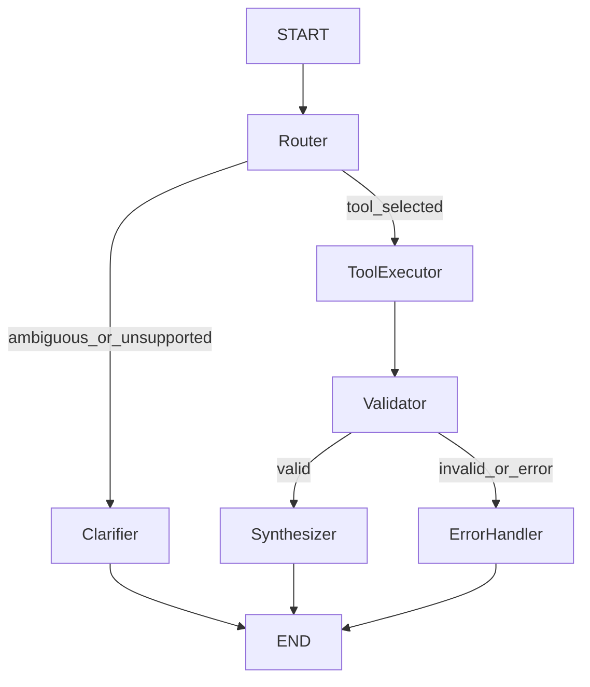

# TICKET-07 Primer: LangGraph 6-Node Graph + System Prompt

**For:** New Cursor Agent session  
**Project:** AgentForge - Ghostfolio + AI Agent Integration  
**Date:** Feb 24, 2026  
**Previous work:** TICKET-06 (Asset Allocation Advisor implemented, full unit suite at **44 passing**, commit `7258fbdad` on `feature/TICKET-06-allocation-advisor`) - see `Docs/tickets/devlog.md`

---

## What Is This Ticket?

TICKET-07 implements the agent orchestration brain: a deterministic, testable **LangGraph 6-node
topology** plus a robust **system prompt/tool routing layer** that decides which of the 4 completed
tools to call.

This is the first ticket where LLM orchestration is introduced. The tools remain pure deterministic
functions; LangGraph coordinates them.

### Why It Matters

- **Turns tools into an actual agent:** TICKET-03 through TICKET-06 built capabilities; TICKET-07
  wires capability selection + execution + response synthesis.
- **Unblocks streaming API work:** TICKET-08 depends on a graph that can emit meaningful route/tool
  outcomes.
- **Adds safety paths:** Clarifier and Error Handler nodes prevent brittle or confusing behavior on
  ambiguous/out-of-scope inputs.
- **Demo-critical milestone:** This is where user query -> route -> tool -> validated answer becomes
  real.

---

## Branching Rule (Mandatory)

Every ticket must use a dedicated feature branch.

- **Branch for this ticket:** `feature/TICKET-07-langgraph-core`
- **Do not implement new ticket work directly on `main`.**
- **Future naming pattern:** `feature/TICKET-XX-<short-topic>`

---

## Commit Workflow (Same Rule as TICKET-04 through TICKET-06)

The Husky pre-commit hook (`.husky/pre-commit`) runs Nx lint/format checks for TypeScript/Angular
code. For Python-only ticket work:

1. Stage only ticket files explicitly (never `git add .`):
   - `git add "agent/graph/graph.py" "agent/graph/nodes.py" ...`
2. Commit with `--no-verify` to skip irrelevant Nx hooks:
   - `git commit --no-verify -m "TICKET-07: implement LangGraph core and routing tests"`
3. Keep commit scope tight to TICKET-07 files only.

---

## What Was Already Done (TICKET-02 through TICKET-06)

- `agent/auth.py` handles Ghostfolio anonymous auth exchange + token cache/refresh.
- `agent/clients/ghostfolio_client.py` is production-ready with structured errors and endpoint
  methods:
  - `get_portfolio_performance(time_period)`
  - `get_portfolio_details()`
  - `get_portfolio_holdings()`
  - `get_orders(date_range=None)`
- `agent/clients/mock_client.py` mirrors the real client contract for tests.
- All four tool contracts are implemented:
  - `agent/tools/portfolio_analyzer.py`
  - `agent/tools/transaction_categorizer.py`
  - `agent/tools/tax_estimator.py`
  - `agent/tools/allocation_advisor.py`
- Current test baseline after TICKET-06:
  - **44 unit tests passing** (`agent/.venv/bin/python -m pytest agent/tests/unit/`)
- Current graph/prompt state is still placeholder:
  - `agent/graph/state.py`
  - `agent/graph/nodes.py`
  - `agent/graph/graph.py`
  - `agent/prompts.py`
- Integration routing test file is not created yet (`agent/tests/integration/test_graph_routing.py`).

---

## What TICKET-07 Must Accomplish

### Goal

Implement a production-style LangGraph flow that:

1. Defines a concrete `AgentState` schema,
2. Routes user queries to one of the 4 tools (or Clarifier),
3. Executes tools via injected dependencies (no tool instantiation inside nodes),
4. Validates tool results before user-facing synthesis,
5. Produces graceful fallback behavior via Error Handler,
6. Uses a robust system prompt with explicit routing guidance and safety language,
7. Adds deterministic integration tests proving route behavior and failure routing.

### Target Topology (6 Nodes)

### Deliverables Checklist

#### A. Agent State (`agent/graph/state.py`)

- [ ] Replace placeholder with concrete `AgentState` `TypedDict`.
- [ ] Include conversation history + routing + tool execution artifacts, e.g.:
  - `messages` (with LangGraph message reducer)
  - `pending_action` / selected route metadata
  - `tool_name` + `tool_args`
  - `tool_result`
  - `tool_call_history` (for later SSE narration)
  - `error`
  - `final_response`
- [ ] Add type hints that support deterministic node-to-node handoff.

#### B. Prompt Definitions (`agent/prompts.py`)

- [ ] Replace placeholder with system prompt and routing prompt constants.
- [ ] Include persona and constraints:
  - Financial analysis assistant behavior
  - No investment advice wording
  - Prompt-injection resistance language
- [ ] Define each tool with:
  - one-line purpose,
  - WHEN to use,
  - WHEN NOT to use,
  - argument hints.
- [ ] Add few-shot routing examples (including ambiguous query -> Clarifier).

#### C. Node Implementations (`agent/graph/nodes.py`)

- [ ] Implement Router node:
  - choose `portfolio` / `transactions` / `tax` / `allocation` / `clarify`.
- [ ] Implement Tool Executor node:
  - map route to exact tool function and call with injected `api_client`.
- [ ] Implement Validator node:
  - verify `ToolResult.success`,
  - verify non-empty/sane payload shape,
  - route invalid output to Error Handler.
- [ ] Implement Synthesizer node:
  - convert validated result into deterministic response structure/text payload.
- [ ] Implement Clarifier node:
  - return capability-forward clarification response for ambiguous/out-of-scope prompts.
- [ ] Implement Error Handler node:
  - convert structured errors to user-safe recovery guidance.
- [ ] Ensure no raw stack traces or exception internals leak into final responses.

#### D. Graph Wiring (`agent/graph/graph.py`)

- [ ] Replace placeholder with graph builder that composes all 6 nodes.
- [ ] Wire conditional edges exactly as topology requires.
- [ ] Use dependency injection pattern for `api_client` and LLM object(s).
- [ ] Compile the graph into an executable object for use in TICKET-08.
- [ ] (Optional) expose Mermaid graph export helper for documentation.

#### E. Integration Tests (`agent/tests/integration/test_graph_routing.py`)

- [ ] Create new integration test module (currently missing).
- [ ] Use mocked LLM/tool behavior; **no live OpenAI calls** in integration tests.
- [ ] Add canonical routing tests:
  - portfolio query -> performance tool route
  - transactions query -> transaction tool route
  - tax query -> tax tool route
  - allocation/diversification query -> allocation tool route
  - ambiguous/out-of-scope query -> Clarifier route
- [ ] Add failure-path test:
  - tool failure or invalid result -> Error Handler route
- [ ] Assert both route decisions and state transitions, not just final text.

---

## Suggested Routing Contract

Use the already implemented tool function names directly:

| User Intent | Tool Function | Typical Args |
| --- | --- | --- |
| Portfolio performance trend | `analyze_portfolio_performance` | `time_period="ytd"` |
| Transaction activity breakdown | `categorize_transactions` | `date_range="max"` |
| Capital gains estimate | `estimate_capital_gains_tax` | `tax_year=2025`, `income_bracket="middle"` |
| Allocation/diversification analysis | `advise_asset_allocation` | `target_profile="balanced"` |

Fallback route:
- If intent is ambiguous or out-of-domain -> Clarifier (no tool call).

---

## Important Context

### Files to Modify

| File | Action |
| --- | --- |
| `agent/graph/state.py` | Replace placeholder with concrete `AgentState` schema |
| `agent/graph/nodes.py` | Implement 6 node handlers and routing/execution logic |
| `agent/graph/graph.py` | Build and wire LangGraph topology with conditional edges |
| `agent/prompts.py` | Add system prompt + tool routing descriptions + examples |
| `agent/tests/integration/test_graph_routing.py` | Create integration routing tests with mocked dependencies |
| `agent/tests/conftest.py` | Optional shared fixtures/helpers for integration tests |

### Files You Should NOT Modify

- No Ghostfolio app code (`apps/api`, `apps/client`, `libs/*`) for this ticket.
- No Docker/compose changes in this ticket (those belong to TICKET-08+).
- No refactor of already-stable tool math unless a blocker bug is discovered.
- Avoid changing existing unit fixtures for prior tickets unless absolutely required.

### Cursor Rules to Follow

- `.cursor/rules/agent-patterns.mdc` - pure tools + dependency injection + `ToolResult`
- `.cursor/rules/error-handling.mdc` - errors as values, no trace leakage
- `.cursor/rules/tdd-methodology.mdc` - layered testing (integration routing required here)
- `.cursor/rules/ghostfolio-integration.mdc` - endpoint and enum/value contracts
- `.cursor/rules/python-code-style.mdc` - typing/docstrings/import order

---

## Key Complexity Notes

1. **Routing determinism:** Integration tests should validate route selection without relying on
   nondeterministic LLM behavior.
2. **State consistency:** Every node must read/write predictable `AgentState` keys to avoid
   brittle edge routing.
3. **Tool arg defaults:** Router/executor must safely provide defaults so missing user parameters
   do not crash the flow.
4. **Validation boundaries:** Validator should catch obviously invalid payloads and route to
   Error Handler, not Synthesizer.
5. **Clarifier quality:** Clarifier responses should be helpful and capability-driven, not generic
   refusals.
6. **No hidden side effects:** Nodes should not instantiate network clients ad hoc; use injected
   dependencies.

---

## Definition of Done for TICKET-07

- [ ] `agent/graph/state.py` contains concrete `AgentState` schema used by graph nodes.
- [ ] `agent/prompts.py` contains production-style system/routing prompt content.
- [ ] `agent/graph/nodes.py` implements Router, Tool Executor, Validator, Synthesizer, Clarifier,
      Error Handler.
- [ ] `agent/graph/graph.py` compiles a 6-node graph with correct conditional edges.
- [ ] `agent/tests/integration/test_graph_routing.py` exists and covers canonical routing + error path.
- [ ] Integration tests pass locally without real network/LLM calls.
- [ ] Existing unit suite still passes (`agent/tests/unit/` remains green).
- [ ] `Docs/tickets/devlog.md` updated after completion.
- [ ] Work committed on `feature/TICKET-07-langgraph-core` with `--no-verify`.

---

## Estimated Time: 120-180 minutes

| Task | Estimate |
| --- | --- |
| Design `AgentState` and routing contract | 20 min |
| Implement prompts + router/executor logic | 40 min |
| Implement validator/synthesizer/clarifier/error handler | 35 min |
| Wire graph and conditional edges | 20 min |
| Add integration routing tests + mocks | 35 min |
| Run tests + fix failures | 20 min |
| Devlog + commit workflow | 10 min |

---

## After TICKET-07: What Comes Next

- **TICKET-08: FastAPI SSE Endpoint + Event Mapping** - expose graph execution via
  `POST /api/agent/chat` streaming events (`thinking`, `tool_call`, `tool_result`, `token`, `done`,
  `error`) to the frontend.
