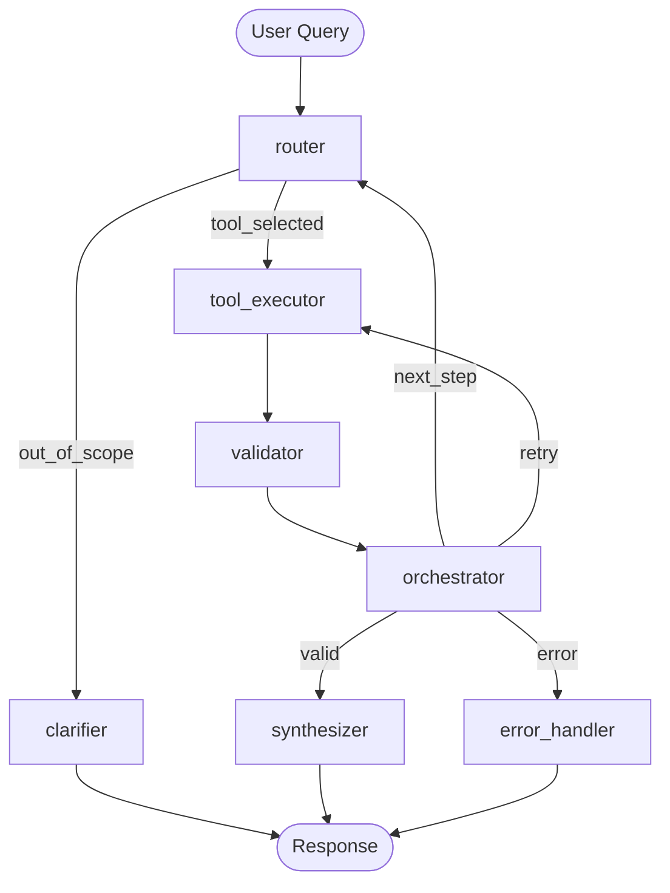

# AgentForge

**AI-Powered Financial Analysis Agent for Ghostfolio**

AgentForge adds an intelligent financial analysis agent to [Ghostfolio](https://github.com/ghostfolio/ghostfolio), an open-source wealth management platform. Ask questions in natural language and get portfolio insights grounded in your real data — with citations, confidence scores, and full transparency into the agent's reasoning chain.

- 6 specialized financial analysis tools with Pydantic-validated schemas
- Multi-step orchestration for complex queries (chains 2-3 tools automatically)
- Real-time SSE streaming with chain-of-thought visibility
- Citations and confidence scoring on every response

## Architecture

AgentForge uses a 7-node [LangGraph](https://github.com/langchain-ai/langgraph) state machine. The **router** classifies user queries via OpenAI native function calling (with a deterministic keyword fallback), dispatches to the appropriate tool, validates results, and optionally chains additional tools before synthesizing a natural-language response.



| Node              | Role                                                                          |
| ----------------- | ----------------------------------------------------------------------------- |
| **router**        | Classifies intent via GPT-4o function calling; falls back to keyword matching |
| **tool_executor** | Runs the selected tool against live Ghostfolio data                           |
| **validator**     | Checks tool output for errors, empty data, schema violations                  |
| **orchestrator**  | Decides: synthesize, chain another tool, retry, or fail                       |
| **synthesizer**   | GPT-4o narrates raw tool data into a human-readable response with citations   |
| **clarifier**     | Returns a helpful message when the query is out of scope                      |
| **error_handler** | Produces user-safe error messages for known failure codes                     |

## Tools

| Tool                            | Description                                                           | Key Parameters                                                |
| ------------------------------- | --------------------------------------------------------------------- | ------------------------------------------------------------- |
| `analyze_portfolio_performance` | Portfolio returns and performance trend                               | `time_period`: 1d, wtd, mtd, ytd, 1y, 5y, max                 |
| `categorize_transactions`       | Group activities by type (BUY/SELL/DIVIDEND/FEE/INTEREST/LIABILITY)   | `date_range`: 1d to max                                       |
| `estimate_capital_gains_tax`    | FIFO-based capital gains tax estimation                               | `tax_year`, `income_bracket`: low/middle/high                 |
| `advise_asset_allocation`       | Compare allocation vs target profile, suggest rebalancing             | `target_profile`: conservative/balanced/aggressive            |
| `check_compliance`              | Regulatory screening (wash sales, pattern day trading, concentration) | `check_type`: all/wash_sale/pattern_day_trading/concentration |
| `get_market_data`               | Current prices and market metrics for holdings                        | `symbols`, `metrics`                                          |

All tools are registered in a formal registry (`agent/tools/registry.py`) with Pydantic input schemas that generate OpenAI function-calling definitions automatically.

## Tech Stack

| Layer          | Technology                                            |
| -------------- | ----------------------------------------------------- |
| Agent Backend  | Python 3.11, FastAPI, LangGraph, GPT-4o               |
| Orchestration  | 7-node LangGraph state machine with conditional edges |
| Streaming      | Server-Sent Events with 6 typed event kinds           |
| Frontend       | Angular 19 chat widget (FAB + slide-out panel)        |
| Platform       | Ghostfolio (NestJS + PostgreSQL + Redis)              |
| Infrastructure | Docker Compose (4 containers), Railway (production)   |

## Quick Start

### Prerequisites

- [Docker](https://www.docker.com/products/docker-desktop) installed
- An [OpenAI API key](https://platform.openai.com/api-keys)

### 1. Clone and configure

```bash
git clone https://github.com/alediez2048/Gauntlet-Assignment-2.git
cd Gauntlet-Assignment-2
cp .env.example .env
```

Edit `.env` and set these values:

- `OPENAI_API_KEY` — your OpenAI API key
- `POSTGRES_PASSWORD` — any password
- `REDIS_PASSWORD` — any password
- `ACCESS_TOKEN_SALT` — any random string
- `JWT_SECRET_KEY` — any random string

### 2. Start all services

```bash
docker compose -f docker/docker-compose.yml -f docker/docker-compose.agent.yml --env-file .env up -d --build
```

This starts 4 containers: PostgreSQL, Redis, Ghostfolio, and the Agent.

### 3. Seed the portfolio (first time only)

```bash
# Create a user and capture the access token
ACCESS_TOKEN=$(curl -sS -X POST http://localhost:3333/api/v1/user \
  | python3 -c "import sys,json; print(json.load(sys.stdin)['accessToken'])")

# Get a Bearer JWT
AUTH_TOKEN=$(curl -sS -X POST http://localhost:3333/api/v1/auth/anonymous \
  -H "Content-Type: application/json" \
  -d "{\"accessToken\":\"$ACCESS_TOKEN\"}" \
  | python3 -c "import sys,json; print(json.load(sys.stdin)['authToken'])")

# Import 26 seed transactions (SPY, AAPL, MSFT, NVDA, BND, VNQ, TSLA)
curl -sS -X POST http://localhost:3333/api/v1/import \
  -H "Authorization: Bearer $AUTH_TOKEN" \
  -H "Content-Type: application/json" \
  -d @docker/seed-data.json

# Save the access token to .env and restart the agent
# Set GHOSTFOLIO_ACCESS_TOKEN=$ACCESS_TOKEN in .env, then:
docker compose -f docker/docker-compose.yml -f docker/docker-compose.agent.yml \
  --env-file .env up -d gf-agent
```

### 4. Verify

```bash
curl -s http://localhost:3333/api/v1/health   # {"status":"OK"}
curl -s http://localhost:8000/health           # {"status":"ok","version":"synth-v2"}
```

### 5. Use the agent

1. Open `http://localhost:3333` and sign in with your access token
2. Click the chat FAB (bottom-right corner) to open the AI agent panel
3. Try: **"How is my portfolio doing year to date?"**

## SSE Event Protocol

The agent streams responses via `POST /api/agent/chat` using Server-Sent Events:

| Event         | Payload                                                 | Description                                         |
| ------------- | ------------------------------------------------------- | --------------------------------------------------- |
| `thinking`    | `{message}`                                             | Agent begins analyzing the request                  |
| `tool_call`   | `{tool, args}`                                          | Tool selected and about to execute                  |
| `tool_result` | `{tool, success, error?}`                               | Tool execution complete                             |
| `token`       | `{content}`                                             | Incremental response text                           |
| `done`        | `{thread_id, response, tool_call_history, token_usage}` | Final response with citations, confidence, and cost |
| `error`       | `{code, message}`                                       | Known error (AUTH_REQUIRED, EMPTY_PORTFOLIO, etc.)  |

## Testing

All backend tests run without an OpenAI key — they use a deterministic keyword router and mock Ghostfolio client.

```bash
# All backend tests
pytest agent/tests/

# Unit tests only (9 test files)
pytest agent/tests/unit/

# Integration tests (graph routing, multi-step, SSE streaming)
pytest agent/tests/integration/

# Evaluation suite (63 cases, 7 eval types)
pytest agent/tests/eval/

# Frontend tests
npx nx test client
```

**Eval framework**: 63 test cases across 7 evaluation types — tool selection, tool execution, correctness, safety, consistency, edge cases, and latency.

## Project Structure

```
agent/                          # Python agent service
  main.py                       # FastAPI app, SSE streaming, token tracking
  prompts.py                    # System, routing, and synthesis prompts
  auth.py                       # Bearer token authentication
  graph/
    graph.py                    # LangGraph 7-node topology builder
    nodes.py                    # Node implementations
    state.py                    # AgentState schema (TypedDict)
  tools/
    registry.py                 # ToolDefinition registry + OpenAI schema builder
    schemas.py                  # Pydantic input schemas for all 6 tools
    portfolio_analyzer.py       # analyze_portfolio_performance
    transaction_categorizer.py  # categorize_transactions
    tax_estimator.py            # estimate_capital_gains_tax
    allocation_advisor.py       # advise_asset_allocation
    compliance_checker.py       # check_compliance
    market_data.py              # get_market_data
    base.py                     # ToolResult dataclass
  clients/
    ghostfolio_client.py        # Async HTTP client for Ghostfolio API
  tests/
    unit/                       # 9 unit test files
    integration/                # 4 integration test files
    eval/                       # 63-case evaluation dataset + runner
    e2e/                        # Golden path Jupyter notebook
apps/client/src/app/pages/agent/  # Angular chat widget
  components/
    agent-chat-panel/           # Chat panel component
    agent-fab/                  # Floating action button
  services/                    # SSE parser, reducer, endpoint config
docker/
  docker-compose.yml            # Ghostfolio + PostgreSQL + Redis
  docker-compose.agent.yml      # Agent service overlay
  seed-data.json                # 26 transactions across 7 symbols
```

## Demo

See [Docs/DEMO_SCRIPT.md](Docs/DEMO_SCRIPT.md) for a scripted 5-query demo walkthrough.

## Built on Ghostfolio

AgentForge is built on top of [Ghostfolio](https://github.com/ghostfolio/ghostfolio), an open-source wealth management platform by [Ghostfolio](https://ghostfol.io). For Ghostfolio-specific development setup, see [DEVELOPMENT.md](DEVELOPMENT.md).

## License

Licensed under the [AGPLv3 License](https://www.gnu.org/licenses/agpl-3.0.html).
